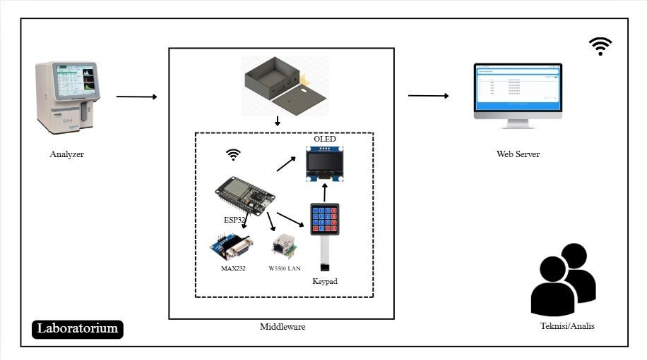
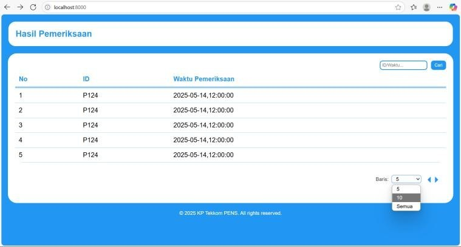
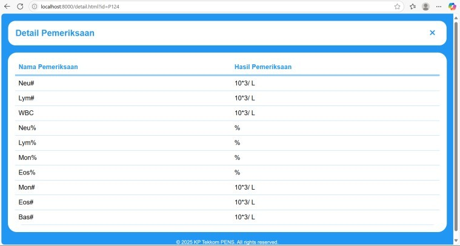

## Overview
This project implements an ESP32-based middleware for processing and transmitting patient data from medical analyzer to a web server.

The middleware receives data in HL7 format, processes and extracts relevant information, and forwards the processed data to a web application through network communication.

An OLED-based with keypad local configuration interface was also integrated unto the middleware to simplify network configuration and connectivity troubleshooting. The interface allows users to configure network parameters directly from the device and monitor its connection status.

This project was developed as part of internship project.

## Design System

## How it Works
1. The ESP32 initializes the middleware and OLED interface
2. Network settings can be configured directly through the device
3. The ESP32 establishes the network connection according to the configured parameters
4. The middleware receives medical analyzer data in HL7 format
5. The HL7 parser processes the incoming message
6. Relevant information is extracted from received data
7. The processed data is transmitted to the web server
8. The web server receives the data through an API endpoint
9. The received data is processed and stored in the local database
10. The processed information can be accessed through the web interface

## Technologies
1. C++
2. ESP32
3. Arduino
4. OLED Display
5. HL7
6. Node.js
7. Express.js
8. SQLite
9. HTTP

## Configuration
Network specific configuration values such as IP addresses, Wi-Fi credentials, and other environment-dependent settings have been removed or replaced with placeholders in this repository. 

Before running the project, configure the required parameters according to the target environment.

**Note:** This repository contains a portfolio version of the project. Certain values and internal network information have been modified or removed to protect confidental information.

## Interface
### Web Interface
#### Main

#### Details

The web application provides an interface for accessing data received through the middleware.

## Demo
**Link:** https://drive.google.com/file/d/1pLdpU-vBH4Wnk17ZGcv3RyXX52KNKCeG/view?usp=sharing

## Scope of Contribution
The project involved improvement of the middleware communication system, including:
1. Developing ESP32-side communication logic
2. Developing an OLED-based with keypad for local configuration interface
3. Implementing network mode and IP configuration through de device
4. Implementing connection status monitoring through the OLED display

## Disclaimer
This repository contains a portfolio version of an internship project.

Certain configuration values, network information, credentials, and environment-specific details have been removed or modified to protect confidential information and internal infrastructure.

No patient-identifiable information is included in this repository. Throughout the internship, all development, testing, and demonstrations were conducted exclusively using dummy data to ensure that no real patient information was involved.
